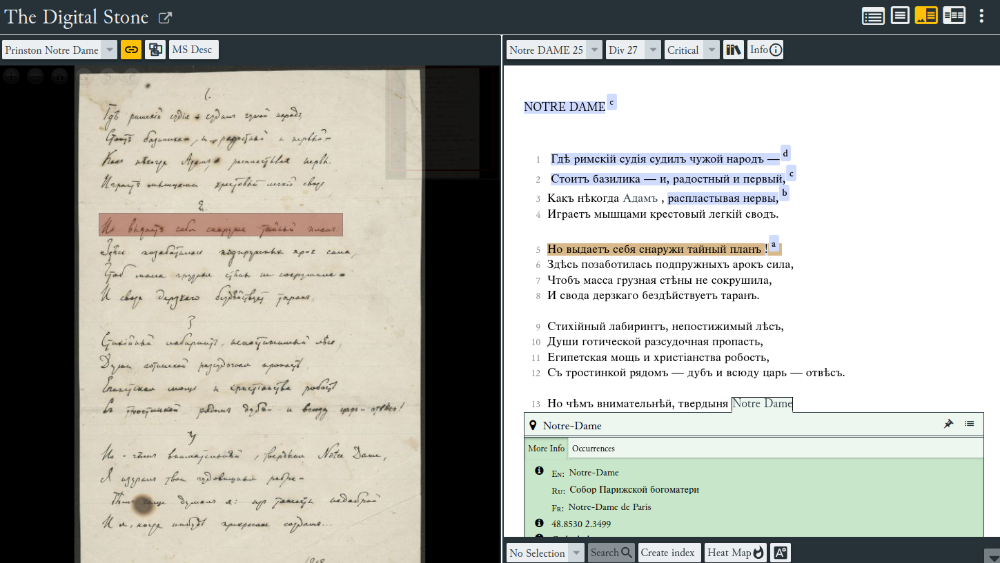

# The Digital Stone

## Project Overview
This project [The Digital Stone](https://mary-lev.github.io/kamen/), built upon the EVT (Edition Visualization Technology) framework, is designed to aggregate and compare all available versions of the poems from Osip Mandelstam's book "Камень / The Stone." The primary objective is to accurately visualize textual differences across multiple editions, down to the most granular changes.

## Framework
- **EVT (Edition Visualization Technology)**: A foundational choice for its adaptability and efficiency in visualizing scholarly digital editions. EVT ensures a smooth user experience complemented by advanced textual comparison tools.

## Source Data
- **First edition**: Камень. Петербург: Акмэ, 1913 (36 pp., Old Russian orthography)
- **Second edition**: Камень. Петроград: Гиперборей, 1916 (90 pp., Old Russian orthography)
- **Updated release**: Камень. М. — Пг.: ГИЗ, 1923 (96 pp., Modern Russian orthography)
- **Latest version**: Стихотворения. М.: Государственное издательство, 1928. (196 pp., Modern Russian orthography)
- **Additional sources**: Press publications and archival manuscripts from Saint-Petersburg and Princeton libraries.

## Implementation
- **Data Aggregation**: Collated raw textual data from all known versions of "The Stone" poems.
- **TEI Integration**: Developed a Python parser to consolidate distinct versions into a single TEI-compliant XML structure.
- **Critical Apparatus Markup**: Enhanced the TEI file leveraging EVT's capabilities.
- **Manuscript Image Mapping**: Used Oxygen XML Editor for precise image map generation.
- **Platform Visualization**: Processed the enriched TEI XML through EVT's rendering engine.

## Key Features
- **Granular comparison**: Enables detection of subtle changes often overlooked in traditional analysis.
- **Comprehensive source inclusion**: Incorporates both primary editions and secondary sources.
- **Intuitive visualization**: Presents data in a clear and accessible manner, optimized by EVT's features, facilitating scholarly research.
- **Structured Indexes**: EVT displays clear and navigable indexes for persons, places, witnesses, and bibliographic entries, streamlining user access and exploration.

## Edition Characteristics
This is a multi-version diplomatic edition with a critical apparatus designed to offer an immersive reading experience and inspire new literary insights.

### Diplomatic
- All text versions are faithfully represented.
- Variations are displayed using `<app>`, `<lem>`, and `<rdg>` elements without bias.
- Allows easy toggling between text versions for direct comparison.

### Critical
- The apparatus (`<app>`, `<lem>`, `<rdg>`) highlights text variations.
- External references, like `<persName ref="#p_eugene_onegin">`, enrich the text with context and interpretation.

## General Structure
- **Textual Components**: Encapsulated by the `<text>`, `<l>`, and `<head>` elements.
- **Annotations & References**: Encompasses `<persName>`, `<placeName>`, and other elements for enriched context.
- **Metadata**: Includes listWit and other sections detailing sources or witnesses.
- **Rhyme Schema**: Highlighted using the `<rhyme>` element.

## Images and Facsimiles
Using the `<lb>` element with the facs attribute, lines of poetry are linked to their respective facsimiles or images. The combination of `<facsimile>`, `<surface>`, and `<zone>` elements creates interactive image maps for each manuscript. These maps allow readers to directly associate lines of poetry with their positions on the original manuscript, blending the digital experience with the tactile essence of the physical source, thereby enriching the user's engagement and understanding.

